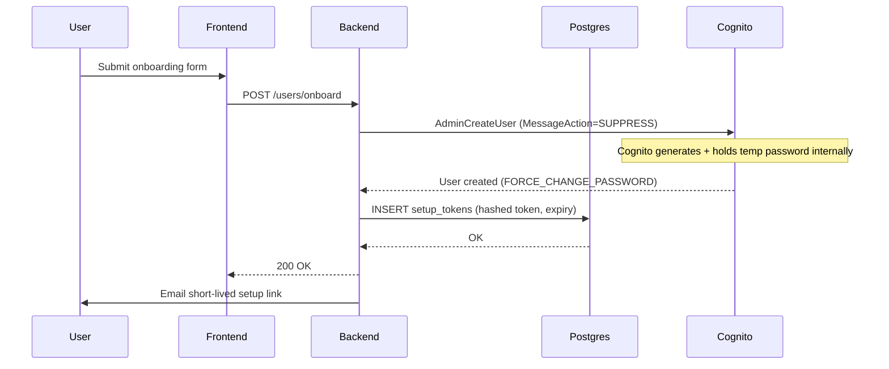
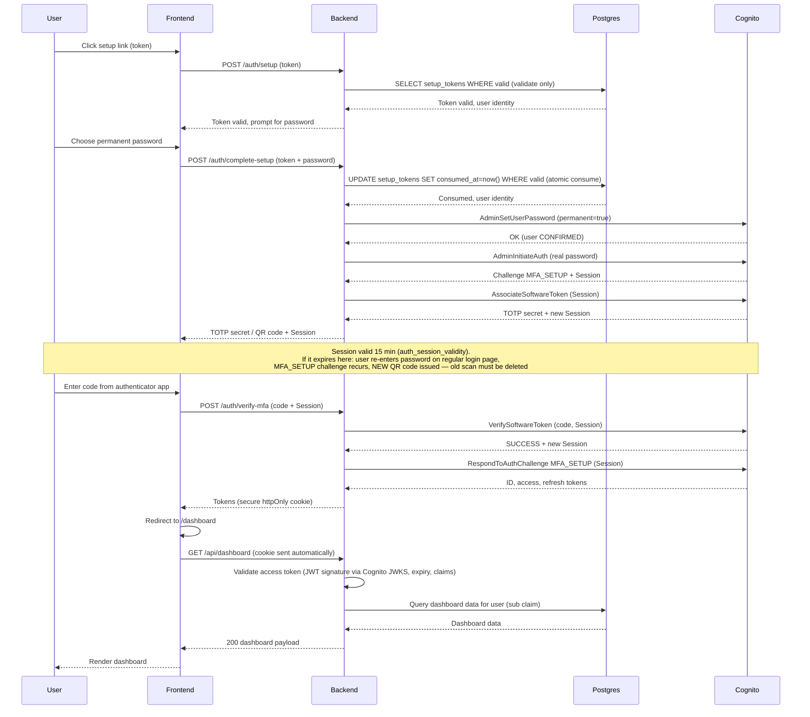
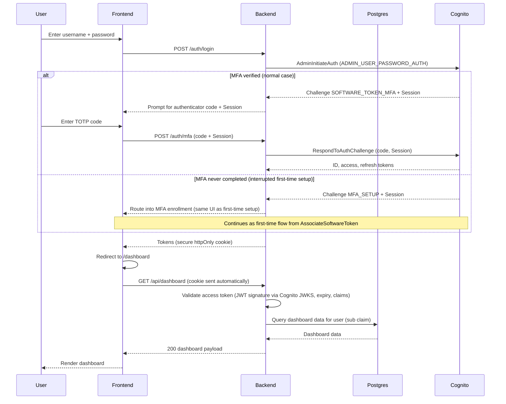
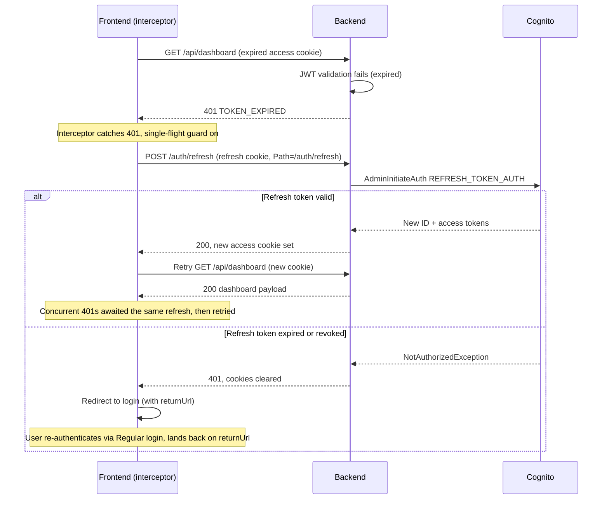

# Cognito auth flows

## User creation

```mermaid
sequenceDiagram
    participant U as User
    participant F as Frontend
    participant B as Backend
    participant P as Postgres
    participant C as Cognito
    U->>F: Submit onboarding form
    F->>B: POST /users/onboard
    B->>C: AdminCreateUser (MessageAction=SUPPRESS)
    Note over C: Cognito generates + holds temp password internally
    C-->>B: User created (FORCE_CHANGE_PASSWORD)
    B->>P: INSERT setup_tokens (hashed token, expiry)
    P-->>B: OK
    B-->>F: 200 OK
    B->>U: Email short-lived setup link
```

## First-time login

```mermaid
sequenceDiagram
    participant U as User
    participant F as Frontend
    participant B as Backend
    participant P as Postgres
    participant C as Cognito
    U->>F: Click setup link (token)
    F->>B: POST /auth/setup (token)
    B->>P: SELECT setup_tokens WHERE valid (validate only)
    P-->>B: Token valid, user identity
    B-->>F: Token valid, prompt for password
    U->>F: Choose permanent password
    F->>B: POST /auth/complete-setup (token + password)
    B->>P: UPDATE setup_tokens SET consumed_at=now() WHERE valid (atomic consume)
    P-->>B: Consumed, user identity
    B->>C: AdminSetUserPassword (permanent=true)
    C-->>B: OK (user CONFIRMED)
    B->>C: AdminInitiateAuth (real password)
    C-->>B: Challenge MFA_SETUP + Session
    B->>C: AssociateSoftwareToken (Session)
    C-->>B: TOTP secret + new Session
    B-->>F: TOTP secret / QR code + Session
    Note over U,C: Session valid 15 min (auth_session_validity).<br/>If it expires here: user re-enters password on regular login page,<br/>MFA_SETUP challenge recurs, NEW QR code issued — old scan must be deleted
    U->>F: Enter code from authenticator app
    F->>B: POST /auth/verify-mfa (code + Session)
    B->>C: VerifySoftwareToken (code, Session)
    C-->>B: SUCCESS + new Session
    B->>C: RespondToAuthChallenge MFA_SETUP (Session)
    C-->>B: ID, access, refresh tokens
    B-->>F: Tokens (secure httpOnly cookie)
    F->>F: Redirect to /dashboard
    F->>B: GET /api/dashboard (cookie sent automatically)
    B->>B: Validate access token (JWT signature via Cognito JWKS, expiry, claims)
    B->>P: Query dashboard data for user (sub claim)
    P-->>B: Dashboard data
    B-->>F: 200 dashboard payload
    F-->>U: Render dashboard
```

## Regular login

```mermaid
sequenceDiagram
    participant U as User
    participant F as Frontend
    participant B as Backend
    participant P as Postgres
    participant C as Cognito
    U->>F: Enter username + password
    F->>B: POST /auth/login
    B->>C: AdminInitiateAuth (ADMIN_USER_PASSWORD_AUTH)
    alt MFA verified (normal case)
        C-->>B: Challenge SOFTWARE_TOKEN_MFA + Session
        B-->>F: Prompt for authenticator code + Session
        U->>F: Enter TOTP code
        F->>B: POST /auth/mfa (code + Session)
        B->>C: RespondToAuthChallenge (code, Session)
        C-->>B: ID, access, refresh tokens
    else MFA never completed (interrupted first-time setup)
        C-->>B: Challenge MFA_SETUP + Session
        B-->>F: Route into MFA enrollment (same UI as first-time setup)
        Note over F,C: Continues as first-time flow from AssociateSoftwareToken
    end
    B-->>F: Tokens (secure httpOnly cookie)
    F->>F: Redirect to /dashboard
    F->>B: GET /api/dashboard (cookie sent automatically)
    B->>B: Validate access token (JWT signature via Cognito JWKS, expiry, claims)
    B->>P: Query dashboard data for user (sub claim)
    P-->>B: Dashboard data
    B-->>F: 200 dashboard payload
    F-->>U: Render dashboard
```

## Session refresh (reactive)

```mermaid
sequenceDiagram
    participant F as Frontend (interceptor)
    participant B as Backend
    participant C as Cognito
    F->>B: GET /api/dashboard (expired access cookie)
    B->>B: JWT validation fails (expired)
    B-->>F: 401 TOKEN_EXPIRED
    Note over F: Interceptor catches 401, single-flight guard on
    F->>B: POST /auth/refresh (refresh cookie, Path=/auth/refresh)
    B->>C: AdminInitiateAuth REFRESH_TOKEN_AUTH
    alt Refresh token valid
        C-->>B: New ID + access tokens
        B-->>F: 200, new access cookie set
        F->>B: Retry GET /api/dashboard (new cookie)
        B-->>F: 200 dashboard payload
        Note over F: Concurrent 401s awaited the same refresh, then retried
    else Refresh token expired or revoked
        C-->>B: NotAuthorizedException
        B-->>F: 401, cookies cleared
        F->>F: Redirect to login (with returnUrl)
        Note over F: User re-authenticates via Regular login, lands back on returnUrl
    end
```
