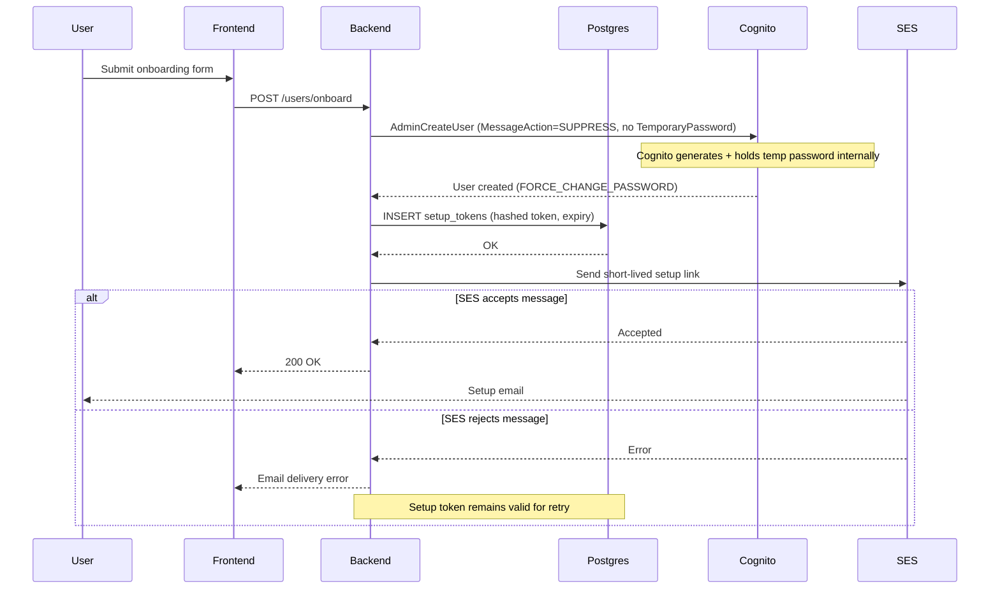
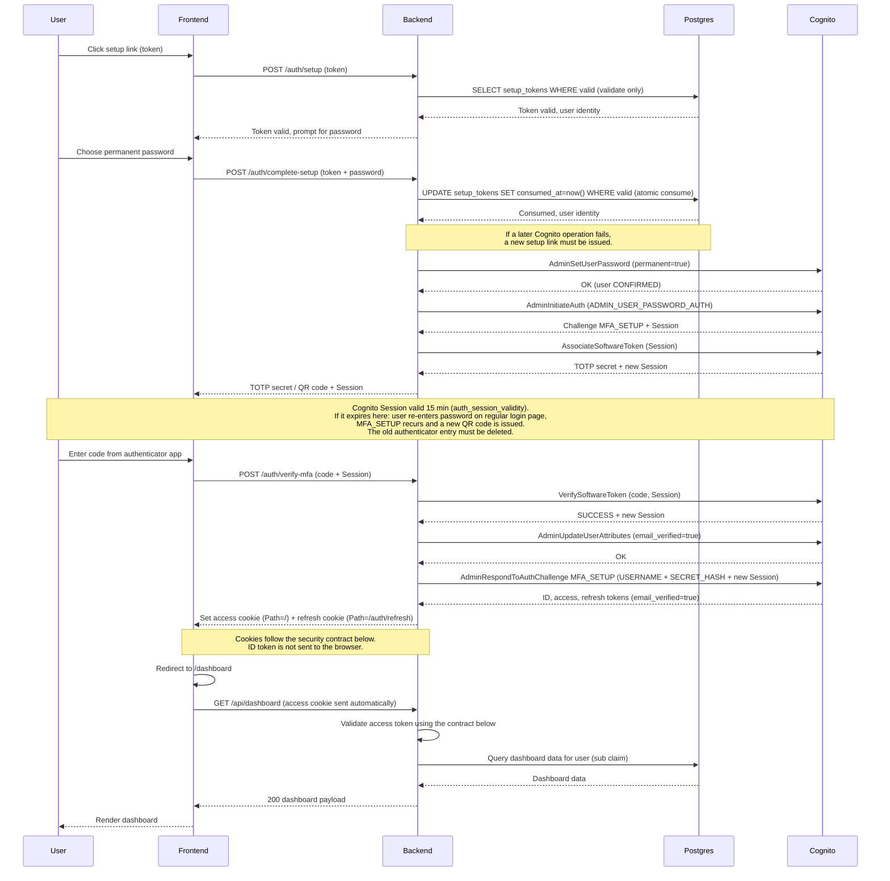
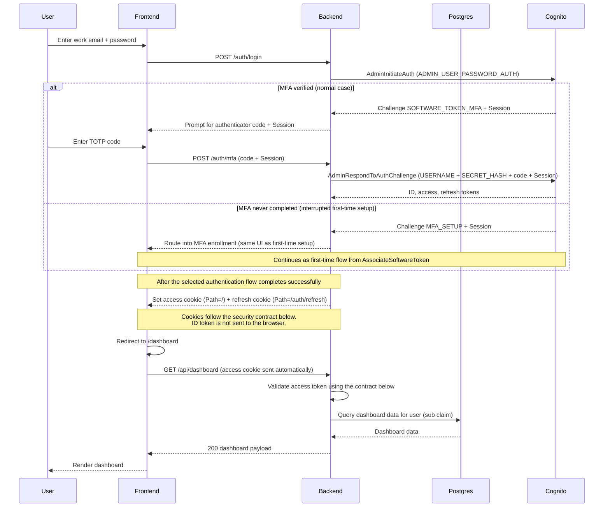
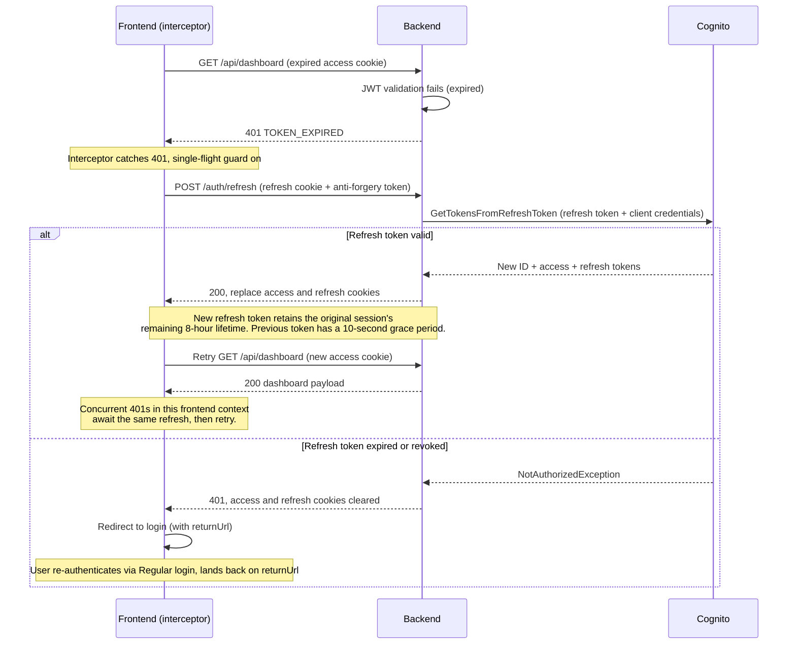

# Cognito auth flows

## User creation

## First-time login

## Regular login

## Session refresh (reactive)

## Cookie and CSRF security contract

- Authentication cookies must be host-only (no `Domain` attribute), `Secure`,
  `HttpOnly`, and `SameSite=Strict`.
- The access cookie uses `Path=/`. The refresh cookie uses
  `Path=/auth/refresh` and must not be sent to other endpoints.
- Every state-changing request must include an anti-forgery token and have its
  `Origin` header matched against an exact allowlist. Missing, malformed, or
  untrusted origins must fail closed.
- Logout must revoke the Cognito refresh token and expire both cookies using
  the same path and security attributes with which they were issued.

## Access-token validation contract

- Accept only Cognito access tokens with `token_use=access`; ID tokens must
  never be accepted as API bearer tokens.
- Require the exact configured Cognito issuer and app-client `client_id`.
- Allow only the expected Cognito signing algorithm and validate the token
  lifetime, including `exp` and `nbf` when present.
- Resolve the signing key by `kid` from the configured user pool's HTTPS JWKS
  endpoint. Refresh the JWKS once for an unknown `kid`, then fail closed if the
  key or signature still cannot be validated.
